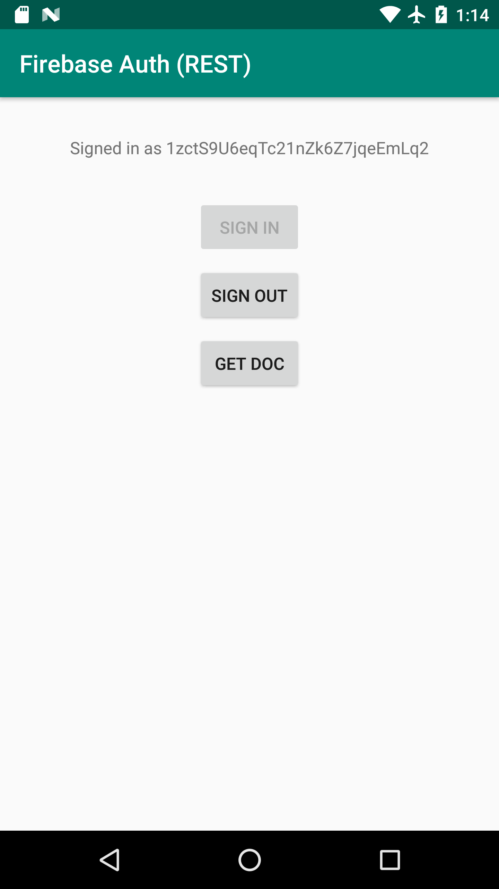

# Firebase Authentication without Google Play services

This sample shows how to implement a Firebase `InternalAuthProvider` on top of the Firebase Authentication REST API,
allowing your app to use many Firebase products on devices without Google Play services.

The following Firebase products which depend on Firebase Authentication should work with this method:

  * Firebase Realtime Database
  * Cloud Firestore
  * Cloud Functions for Firebase
  * Cloud Storage


## Disclaimer

It's important to understand the limitations of this sample code:

  * The code in this repository is for demonstration purposes and has not been tested in production.
  * Firebase supports usage on non-Play services devices on a best-effort basis.  We expect that many 
    of our products will work without Play services but we do not guarantee it and our Support team
    cannot help with issues that arise on these devices.

## Architecture

Firebase SDKs discover each other through a "component" system. This is how some products can "depend"
on Firebase Authentication without actually having a code dependency on the `firebase-auth` library.

In `AndroidManifest.xml` the app defines a "registrar" which provides the auth implementation:

```xml
  <service android:name="com.google.firebase.components.ComponentDiscoveryService">
      <meta-data
        android:name="com.google.firebase.components:com.google.firebase.nongmsauth.internal.RestAuthRegistrar"
        android:value="com.google.firebase.components.ComponentRegistrar" />
  </service>
```

The `RestAuthRegistrar` class provides the implementation and declares its dependencies:

```kotlin
@Keep
class RestAuthRegistrar : ComponentRegistrar {

    override fun getComponents(): MutableList<Component<*>> {
        val restAuthCompontent =
            Component.builder(InternalAuthProvider::class.java)
                .add(Dependency.required(FirebaseApp::class.java))
                .factory { container ->
                    val firebaseApp = container.get(FirebaseApp::class.java)
                    return@factory FirebaseRestAuth.getInstance(firebaseApp)
                }
                .build()

        return mutableListOf(restAuthCompontent)
    }

}
```

We can see that the registrar has only one dependency, `FirebaseApp`, which is provided by 
the `firebase-common` library.

The registrar produces instances of the `InternalAuthProvider` interface which is a stable interface
provided by the `firebase-auth-interop` library:
https://firebase.google.com/docs/reference/android/com/google/firebase/auth/internal/InternalAuthProvider

The implementation of the authentication flow is in `RestAuthProvider`, which is exposed through the
`FirebaseRestAuth` class.

## Usage

### Authentication

For simplicity, this example only implements anonymous authentication. Implementing more authentication
methods is left as an exercise to the reader.

Using the `FirebaseRestAuth` class should be familiar to `FirebaseAuth` users:

```kotlin
val app: FirebaseApp = FirebaseApp.getInstance()
val auth: FirebaseRestAuth = FirebaseRestAuth.getInstance(app)
```

The current user can be accessed as a property of `auth`:

```kotlin
if (auth.currentUser == null) {
  // Signed out
} else {
  // Signed in
}
```

To sign in, simply call `signInAnonymously` which returns a `Task`:

```kotlin
auth.signInAnonymously()
    .addOnSuccessListener { res ->
        // Success...
    }
    .addOnFailureListener { err ->
        // Failure...
    }
```

To sign out, call the synchronous `signOut` method:

```kotlin
auth.signOut()
```

### Token Management

The real `FirebaseAuth` library proactively refreshes your ID Token as it get close to expiry,
which means that you never have to think about token management.

In this example you must instantiate the `FirebaseTokenRefresher` class to perform token management.
This class binds to a `LifecycleOwner` to make sure that it only refreshes your token when the app
is in the foreground.

In your `Activity`:

```kotlin
// See above
val auth = ...;

// Create a TokenRefresher, which will proactively refresh the user's ID token 10 minutes
// before it expires as long as the lifecycle is alive. Response to the ON_START and ON_STOP
// lifecycle events.
val refresher = TokenRefresher(auth, this /* LifecycleOwner */);
```

## Example

If you run the sample app in this repository you can see the concepts above in action:



The **Get Doc** button attempts to fetch the document `test/test` from Cloud Firestore, which
demonstrates how the authentication context is seamlessly picked up by other SDKs.

If you set the following rules in Cloud Firestore, you will see that the "Get Doc" operation
succeeds when you are signed in and fails when you are signed out:

```
service cloud.firestore {
  match /databases/{database}/documents {
    match /{document=**} {
      allow read, write: if request.auth.uid != null;
    }
  }
}
```